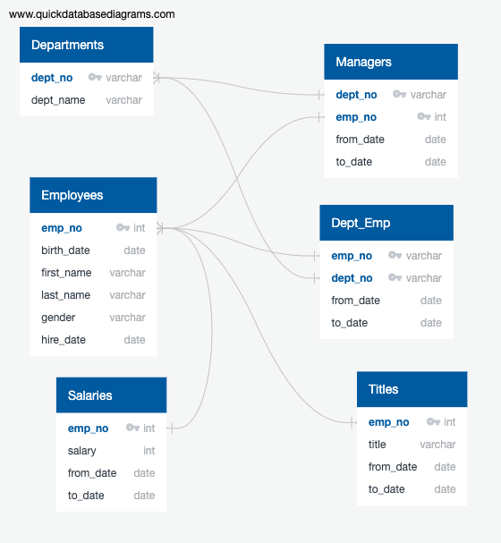

# Pewlett-Hackard-Analysis

## Overview of Pewlett Hackard Analysis

### Purpose
The purpose of this analysis is to analyze the data from Pewlett Hackard to determine how many people from each department are retiring so that they can make informed decisions about how many people they need to hire to fill the departments. We also used the data to help create a list of employees who were eligible to participate in a mentorship initiative.

## Results
* We created a Entity Relationship Diagram to help us visualize the commonalities and relationships between the different data files. This helped us to create new tables with information from different tables in order to find a list of employees that were retiring from each department as well as a list of employees that were eligible to participate in a mentorship initiative. 
* The retirement_titles.csv file that we created had a list of all the employees that are going to retire soon. This list contained 133,776 people. This is a significant amount of people. 
* The retiring_titles.csv file that we created showed how many of each title were retiring. A significant finding from this table is that the majority of the retiring people are Senior Engineers and Senior Staff. This means that Pewlett Hackard needs to either hire experienced people to replace these roles or promote employees within the company. Either way they need to have a plan in place to fill these roles as these roles are an integral part of the business.
* The mentorship_eligibility.csv file contains a list of employees that are currently working at the company who would be eligible to train lower employees. This list is super helpful because as many jobs open up due to employees retiring, a mentorship program could help lower level employees get promoted to fill these positions.

#### Pewlett Hackard ERD

## Pewlett Hackard Summary
Pewlett Hackard has a significant number of retiring employees. In total they have 133,776 employees looking to retire in the near future. The majority of the retiring employees are retiring from senior positions. There are only 1,549 people eligible to mentor. Although Pewlett Hackard will be able to help a lot of lower level employees level up to more senior positions, I do not think that this will be enough and I recommend that Pewlett Hackard look into providing training programs and hiring talent from outside of the organization to help fill some of these senior positions. I would conduct another query to find out how many employees are not close to retiring and are in lower level positions to determine how many employees have the potential of getting promoted to more senior positions. I would also create a query to determine how many people are eligible for the mentorship initiative per department to determine whether certain departments may need to have special training programs. 
